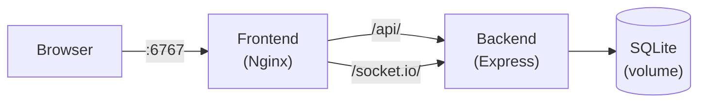

ExcaliDash is a two-container application. The backend is a Node.js Express server that owns the database, auth, REST API, and real-time collaboration over Socket.IO. The frontend is a React single-page app built with Vite and served by Nginx in production, which proxies API and WebSocket traffic to the backend container. In local development, Vite's built-in proxy replaces Nginx for the same purpose.

## Backend

The backend lives in `backend/src/` and is written in TypeScript. It uses Express 5, Prisma as the ORM, Socket.IO for real-time collaboration, and SQLite as the default database.

### Entry point and startup

`backend/src/index.ts` is the server entry point. On startup it:

1. Loads and validates environment variables via `backend/src/config.ts`
2. Configures Express middleware: Helmet, CORS, rate limiting, CSRF protection, and request logging
3. Registers all route modules (auth, dashboard, import/export, system)
4. Registers Socket.IO handlers for real-time collaboration
5. Issues a bootstrap setup code if auth is enabled and no active users exist

`backend/src/config.ts` is the single source of truth for all environment variable validation. If a required variable is missing or malformed, the process exits at startup with a descriptive error.

### Auth

| Path | Purpose |
|---|---|
| `backend/src/auth.ts` | Auth router: login, register, OIDC callback, refresh, logout |
| `backend/src/auth/` | Bootstrap setup code, onboarding gate, OIDC client, token utilities |
| `backend/src/middleware/auth.ts` | `requireAuth` and `optionalAuth` middleware used by route handlers |

Auth mode is controlled by the `AUTH_MODE` environment variable (`local`, `hybrid`, `oidc_enforced`). The `authModeService` reads this at runtime and caches the result with a short TTL to avoid repeated DB reads.

### API routes

Dashboard routes are registered by `backend/src/routes/dashboard/` and grouped by resource:

| Route module | Resources |
|---|---|
| `drawings` | Create, read, update, delete, and list drawings |
| `collections` | Create, rename, delete, and list collections |
| `library` | Manage the shared Excalidraw element library |
| `trash` | Soft-delete and restore drawings via the trash collection |

Additional route modules:

- `backend/src/routes/importExport.ts` — archive export and ZIP import of drawings and collections
- `backend/src/routes/system/` — version info, update checks, and the `/health` endpoint

### Real-time collaboration

`backend/src/server/socket.ts` registers Socket.IO event handlers for the Excalidraw collaboration protocol. Presence state (cursors, collaborators) is tracked in-memory in the backend process. This means only a single backend replica is supported — see [Scaling](/deployment/scaling) for details.

The Socket.IO server shares the same HTTP server as Express and is initialized in `backend/src/index.ts`.

### Database

ExcaliDash uses SQLite via [Prisma](https://www.prisma.io/). The schema lives at `backend/prisma/schema.prisma`. The Prisma client is wrapped and cached in `backend/src/db/prisma.ts`.

**Data models:**

| Model | Purpose |
|---|---|
| `User` | Account records with role, auth provider, and activation state |
| `Drawing` | Excalidraw scene data (elements, appState, files) and metadata |
| `Collection` | Named folders for organizing drawings; the Trash is a special collection |
| `DrawingPermission` | Per-user access grants for sharing drawings within the instance |
| `DrawingLinkShare` | Token-based public or restricted share links for drawings |
| `Library` | Per-user saved Excalidraw element library |
| `AuditLog` | Structured event log for security-relevant actions (when audit logging is enabled) |

## Frontend

The frontend lives in `frontend/src/` and is a React 18 single-page application built with Vite and TypeScript. It uses Tailwind CSS for styling and integrates the `@excalidraw/excalidraw` package for the drawing canvas.

### Key files and directories

| Path | Purpose |
|---|---|
| `frontend/src/api/index.ts` | Centralized API client (Axios); all HTTP calls and auth endpoint wiring |
| `frontend/src/App.tsx` | Route definitions and context provider tree |
| `frontend/src/pages/` | Route-level page components |
| `frontend/src/context/` | `AuthContext` (session state, token refresh) and `ThemeContext` (light/dark mode) |
| `frontend/src/pages/Editor.tsx` | Excalidraw canvas integration and Socket.IO collaboration wiring |
| `frontend/vite.config.ts` | Vite dev proxy, compile-time app metadata, and build configuration |

### Pages

| Page | Route |
|---|---|
| `Dashboard` | `/` and `/collections` — drawing list, search, drag-and-drop into collections |
| `Editor` | `/editor/:id` — Excalidraw canvas with Socket.IO collaboration |
| `Admin` | `/admin` — user management, audit log viewer |
| `Login` | `/login` |
| `Register` | `/register` |
| `Settings` | `/settings` |
| `Profile` | `/profile` |

### Editor and collaboration

`frontend/src/pages/Editor.tsx` is the most complex page in the frontend. It mounts the `@excalidraw/excalidraw` component, connects a Socket.IO client to the backend, and synchronizes scene changes (elements, appState, cursors) across collaborators in real time.

In local development, Vite proxies `/api/` and `/socket.io/` to the backend via the proxy config in `vite.config.ts`. The target URL is set by the `VITE_DEV_BACKEND_URL` environment variable (default `http://localhost:8000`).

## Deployment architecture

In production, ExcaliDash runs as two Docker containers managed by Docker Compose on a shared `excalidash-network`.

The frontend Nginx container uses `frontend/nginx.conf.template` to proxy `/api/` and `/socket.io/` to the backend. The `BACKEND_URL` environment variable on the frontend container controls the proxy target (default `backend:8000`). For Kubernetes, set `BACKEND_URL` to the backend service DNS name.

See [Docker deployment](/deployment/docker) and [Reverse proxy setup](/deployment/reverse-proxy) for production configuration details.

## Tech stack

| Layer | Technology |
|---|---|
| Backend server | [Express](https://expressjs.com/) 5 + TypeScript |
| ORM | [Prisma](https://www.prisma.io/) 5 |
| Database | SQLite (via `better-sqlite3`) |
| Real-time | [Socket.IO](https://socket.io/) 4 |
| Frontend framework | [React](https://react.dev/) 18 |
| Build tool | [Vite](https://vitejs.dev/) 7 |
| Styling | [Tailwind CSS](https://tailwindcss.com/) 3 |
| Drawing canvas | [@excalidraw/excalidraw](https://www.npmjs.com/package/@excalidraw/excalidraw) 0.17 |
| Auth | JWT (access + refresh) + OIDC via `openid-client` |
| Production serving | Nginx (frontend container) |

## Related pages

<CardGroup cols={2}>
  <Card title="Local setup" icon="terminal" href="/development/local-setup">
    Get the backend and frontend running from source.
  </Card>
  <Card title="Contributing" icon="code-pull-request" href="/development/contributing">
    Workflow, testing, and how to file issues.
  </Card>
  <Card title="Environment variables" icon="sliders" href="/configuration/environment-variables">
    Full reference for all backend configuration variables.
  </Card>
  <Card title="Docker deployment" icon="docker" href="/deployment/docker">
    Production container setup and image tags.
  </Card>
</CardGroup>
